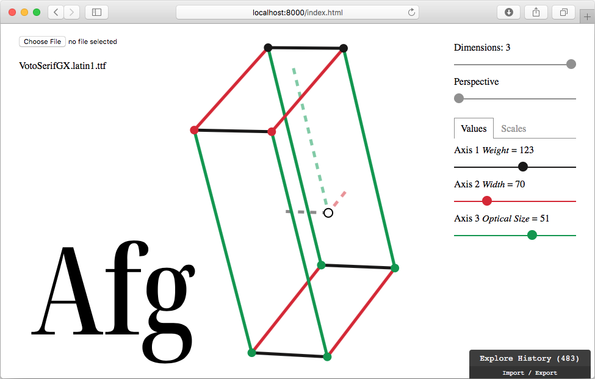

# Font Dimensions

A tool to visualize dimensions of a variable font. [Click for online demo](http://fvar.unsoundscapes.com).

Tested to work in the latest Chrome and Safari browsers.

# Usage:

1. Load a variable font file in the top left corner
2. Use the `Dimensions` slider to control how many dimensions to show
3. `Values` sliders change the values for axes
4. `Scales` sliders change the lengths of the axes
5. Drag the screen to rotate the visualization in 3d
6. Click to edit the sample text, the default is “Afg”

# Resources:

1. [Elm](http://elm-lang.org/) programming language
2. [opentype.js](https://opentype.js.org) to parse font files
3. [opensolid](https://github.com/opensolid) is used for geometry
4. [Voto Serif GX](https://github.com/twardoch/varfonts-ofl) font is included for the demo purpose

# Aknowledgements

1. Lucas de Groot for the original idea
2. Ian Mackenzie for opensolid/geometry library

# Running the demo locally

`elm reactor` and then open http://localhost:8000/index.html